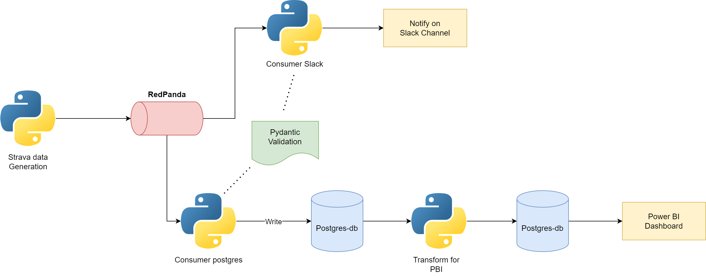
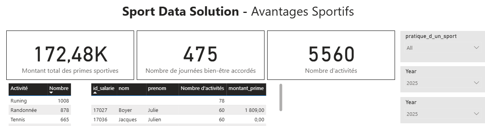

## Sport DATA POC

### Objectifs du POC

- Générer des données similaire à l'API Strava

- Publier des messages sur Slack pour booster les employés

- Créer un dashboard Power BI pour visualiser les KPI

### Initialisation

Installation de l'environement Python:

```bash
uv install
```

Remplir le fichier `.env`.

Lancer RedPanda:

```bash
docker compose -f redpanda/docker-compose.redpanda.yaml up -d
```

Lancement de Prefect:

```bash
docker run -p 4200:4200 -d --rm prefecthq/prefect:3-python3.12 prefect server start --host 0.0.0.0

prefect config set PREFECT_API_URL="http://localhost:4200/api"
```

Lancement de la base de donnée Postgres:

```bash
./postgres-db/setup_postgres.sh
```

Lancement des producer/consumer:

```bash
# Terminal 1:
python -m producer_consumer.producer_strava --interval 5

# Terminal 2: 
python -m producer_consumer.consumer_postgres

# Terminal 3:
python -m producer_consumer.consumer_slack
```


### Modification des constantes et variables d'environement

Les données d'environement sensibles sont stockés dans le fichier `.env`

Le reste des parametres sont présent dans le fichier `config.py`

*Exemple :*

Pour modifier le nombre d'activité nécessaire à l'attribution de la prime sportive, modifier `ACTIVITY_THRESHOLD` dans `config.py` (15 de base)

## Process Flow



### 1 - producer_strava.py

Envoie au broker redpanda des données qui simulent une activité Strava.

Le producer est paramétré pour générer aléatoirement 10% de données erronés pour le POC.

### 2 - consumer_slack.py

Le premier consumer, souscrit au broker et valide l'activité reçu à l'aide d'un modele pydantic `StravaEvent` disponible dans le fichier `model_validation.py`.

Si l'activité est validé il publie un message sur un channel Slack, sinon le message est ignoré et une erreur et renvoyé sur le dashboard de Prefect.

*example :*


### 3 - consumer_postgres.py

Le deuxième consumer souscrit au broker et comme le premier valide la données à l'aide du modele pydantic.

- Si la donnée est validé, elle est inséré dans la base de donnée Postgres dans la table `sport_table`.

- Si la donnée n'est pas validé une erreur est remonté sur Prefect, et la ligne defectueuse ainsi que le message d'erreur sont insérés dans une table d'erreur sur postgres `sport_table_errors.

### 4 - transform_for_pbi.py

Ce script prépare les données pour power BI en utilisant la librairie `Polars`.

Les primes sportives sont calculés, ainsi que les congés bien êtres.

Les données RH sensibles (comme le salaire) sont filtrés.

Les table avec les données finales est réinsérés dans Postgres
- `pbi_rh_table` : les données sur les salariés
- `pbi_sport_table` : les données sur les evenements

### 5 - Visualisation dans Power BI

Rafraichir les données puis visualiser dans l'app power bi.



## Ressources

- Postgres docker image:

https://hub.docker.com/_/postgres

- Postgres docker tutorial:

https://www.datacamp.com/tutorial/postgresql-docker

- Strava API:

https://developers.strava.com/docs/reference/

- API Distance Matrix:

https://developers.google.com/maps/documentation/distance-matrix

- Geocoding API:

https://developers.google.com/maps/documentation/geocoding/get-api-key

- Documentation Prefect Open source:

https://docs.prefect.io/v3/get-started/quickstart#open-source

